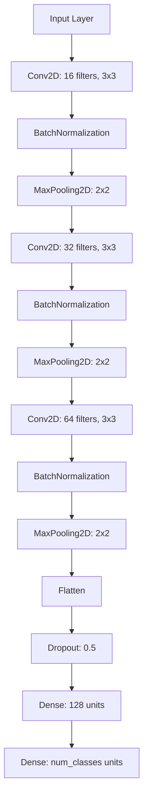

# Sketch-based Image Recognition Model

A deep learning model for recognizing hand-drawn sketches using the Quick Draw dataset, implemented with TensorFlow/Keras. The model aims to classify hand-drawn sketches into various categories, leveraging deep learning techniques to enhance recognition accuracy.

## Table of Contents
- [Overview](#overview)
- [Dataset](#dataset) 
- [Model Architecture](#model-architecture)
  - [Architecture Diagram](#architecture-diagram)
  - [Layer Details](#layer-details)
- [Installation](#installation)
- [Usage](#usage)
- [Results](#results)
- [Contributing](#contributing)

## Overview
This project implements a Convolutional Neural Network (CNN) for classifying hand-drawn sketches from the Quick Draw dataset. The model uses a multi-layer architecture combining convolutional, pooling, and dense layers to achieve robust sketch recognition capabilities.

## Dataset
The model is trained on the [Quick Draw Dataset](https://console.cloud.google.com/storage/browser/quickdraw_dataset/full/numpy_bitmap), which contains millions of labeled sketches across various categories drawn by users worldwide. The dataset's diversity in drawing styles provides an excellent challenge for testing model generalization.

## Model Architecture

### Architecture Diagram



### Layer Details

```python
from tensorflow import keras
from tensorflow.keras import layers

model = keras.Sequential([
    # First Convolutional Block
    layers.Conv2D(16, (3, 3), padding='same', activation='relu', input_shape=input_shape),
    layers.BatchNormalization(),
    layers.MaxPooling2D(pool_size=(2, 2)),
    
    # Second Convolutional Block
    layers.Conv2D(32, (3, 3), padding='same', activation='relu'),
    layers.BatchNormalization(),
    layers.MaxPooling2D(pool_size=(2, 2)),
    
    # Third Convolutional Block
    layers.Conv2D(64, (3, 3), padding='same', activation='relu'),
    layers.BatchNormalization(),
    layers.MaxPooling2D(pool_size=(2, 2)),
    
    # Classification Layers
    layers.Flatten(),
    layers.Dropout(0.5),
    layers.Dense(128, activation='relu'),
    layers.Dense(num_classes, activation='softmax')
])
```

The architecture consists of:

1. **Convolutional Blocks**
   - Three sequential blocks, each containing:
     - Conv2D layer with increasing filters (16 → 32 → 64)
     - Batch Normalization for training stability
     - MaxPooling2D for spatial dimension reduction

2. **Classification Head**
   - Flatten layer to convert 3D features to 1D
   - Dropout (50%) for regularization
   - Dense layers for final classification

## Installation

1. Clone the repository:
```bash
git clone https://github.com/bharathS-web/Sketch-based-image-recognition.git
cd Sketch-based-image-recognition
```

2. Install dependencies:
```bash
pip install -r requirements.txt
```

3. Launch the Streamlit interface:
```bash
streamlit run quickdraw.py
```

## Usage

1. **Data Preparation**
   - Download the Quick Draw dataset
   - Place the data in the `data/` directory
   - Run preprocessing scripts if needed

2. **Model Training**
```python
# Example training code
model.compile(
    optimizer='adam',
    loss='categorical_crossentropy',
    metrics=['accuracy']
)

model.fit(
    x_train,
    y_train,
    batch_size=32,
    epochs=100,
    validation_data=(x_val, y_val)
)
```

3. **Inference**
   - Use the Streamlit interface for real-time sketch recognition
   - Or use the model programmatically for batch processing

## Results
Model performance metrics and visualizations will be added after training completion. Expected metrics include:
- Training/validation accuracy curves
- Confusion matrix
- Example predictions

## Contributing
Contributions are welcome! Please feel free to submit a Pull Request. For major changes:

1. Fork the repository
2. Create your feature branch (`git checkout -b feature/AmazingFeature`)
3. Commit your changes (`git commit -m 'Add some AmazingFeature'`)
4. Push to the branch (`git push origin feature/AmazingFeature`)
5. Open a Pull Request

## License
[Choose an appropriate license]
